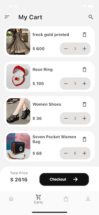
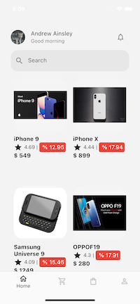
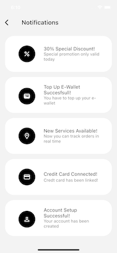
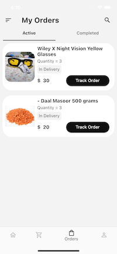
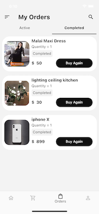
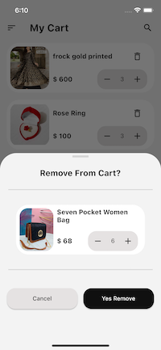

# E commerce

## Projede kullanılan kütüphaneler

- [State Management: provider](https://pub.dev/packages/provider)
- [Singleton: get_it](https://pub.dev/packages/get_it)
- [Localization: easy_localization](https://pub.dev/packages/easy_localization)
- [Navigate: Auto Route](https://pub.dev/packages/auto_route)
- [Network: Dio](https://pub.dev/packages/dio)

 

 

